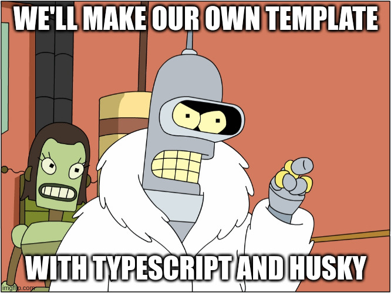

# Modern setup from scratch




## From scratch

If you want to create modern JavaScript project
with Typescript and unit testing support,
please execute following commands in your terminal:

```
npm init -y
npm i -D typescript jest ts-jest @types/jestnpm  @types/jest @jest/globals husky
npm pkg set scripts.build="tsc"
npm pkg set scripts.test="jest"
npm pkg set scripts.postinstall="npx tsc --init && npx ts-jest config:init && git init && ./node_modules/.bin/husky install && npx husky add .husky/pre-commit 'npm test' && git add . && git commit -am first"
npm run postinstall
```

## Install the template

You can do the same work just installing this template with the command

```
npx @yababay67/modern-setup <my-app>
```

Please replace `<my-app>` with name of directory in which
you will develop a project. After installing you should edit 
the `pachage.json` file inside the selected directory.

## Playground

To see how the system protect you code rejectind 
modules of poor quality please execute

```
npm run spoil
```

To repair things run

```
npm run repair
```

